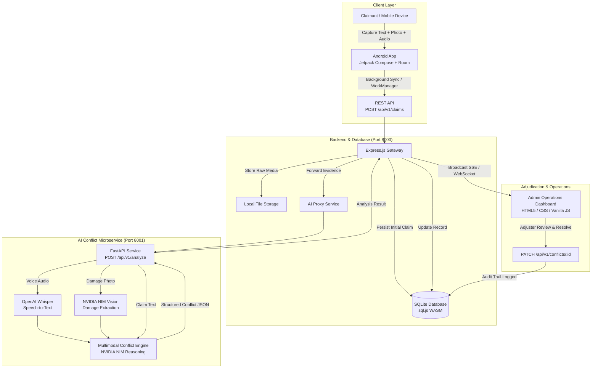

# ClaimLens 🔍

ClaimLens is an AI-powered multimodal insurance claim verification and conflict detection system designed to eliminate fraud and streamline claims triage. By simultaneously analyzing text descriptions, damage photographs, and voice memos submitted with insurance claims, ClaimLens autonomously identifies cross-modal contradictions, evaluates confidence scores, generates structured evidence comparisons, and provides an interactive real-time operations console for adjusters.

> **AI-powered multimodal insurance claim verification.**

---

## 1. Project Overview

Insurance claim fraud and filing discrepancies cost the global insurance industry tens of billions of dollars annually. A primary bottleneck in traditional claim processing is that claimant submissions are multimodal:
- **Text descriptions** entered in mobile forms or web portals
- **Photographic evidence** captured at the incident scene
- **Voice recordings & memos** explaining the sequence of events

In manual review workflows, contradictions between what an insured party *says* (voice), *writes* (text), and *shows* (photo) often slip past initial triage or require hours of adjuster investigation.

**ClaimLens solves this by cross-referencing all three modalities simultaneously.** Using automated speech recognition, computer vision, and multimodal reasoning, ClaimLens detects subtle and glaring discrepancies—such as claiming rear collision damage when the photo shows front bumper impact, or stating a windshield was shattered when voice notes describe minor door scratches. The system surfaces these findings through a real-time admin operations dashboard for rapid adjudication and conflict resolution.

---

## 2. Key Features

- **Multimodal Evidence Capture**: Unified submission pipeline accepting text, high-resolution damage photos (JPEG/PNG), and voice audio recordings (MP3/WAV/M4A/OGG).
- **Offline-First Android App**: Built with Jetpack Compose, CameraX, MediaRecorder, Room local database, and WorkManager background synchronization for low-connectivity environments.
- **AI Voice Transcription**: Audio speech-to-text processing using OpenAI Whisper models.
- **Computer Vision Damage Analysis**: Deep visual inspection powered by NVIDIA NIM vision models extracting damaged vehicle components, impact location, and severity rating.
- **Cross-Modal Conflict Detection**: Reasoning engine that compares text, voice transcript, and photo analysis to identify factual contradictions.
- **Evidence-Based Explanations**: Structured conflict reports highlighting contradicting statements (`Evidence A` vs. `Evidence B`) alongside human-readable explanations and confidence scores.
- **SQLite Database Persistence**: Robust transactional data storage (via `sql.js` WASM engine) for claims, conflict records, and resolution history.
- **Real-Time Operations Dashboard**: Responsive ops portal with live Server-Sent Events (SSE) and WebSocket feeds, KPI metrics, dynamic filtering, and search.
- **One-Click Conflict Resolution**: Complete adjuster resolution workflow with notes capture, status transitions, and immutable audit logs.

---

## 3. How It Works



---

## 4. System Architecture

ClaimLens is structured as a three-tier modular ecosystem:

### 📱 Android Application (`/app`)
- **Modern UI**: Declarative screens built with Jetpack Compose and Material 3.
- **Media Capture**: CameraX for on-device photo capture and Android `MediaRecorder` for audio memo recording.
- **Local Persistence**: Room SQLite database (`ClaimDatabase`) storing drafts and offline claims.
- **Background Sync**: Android Jetpack `WorkManager` with `SyncWorker` ensuring claims recorded offline automatically synchronize when network connectivity is restored.
- **Networking**: Retrofit 2 with OkHttp for multipart form submissions.

### ⚙️ Backend Service (`/backend`)
- **Runtime & Framework**: Node.js and Express.js running on port `8000`.
- **Media Ingestion**: Multer middleware supporting memory storage and structured disk persistence (`/uploads/images` and `/uploads/audio`).
- **Database Layer**: SQLite database running through `sql.js` (WebAssembly-based engine) with disk persistence at `./data/claimlens.db`.
- **Real-Time Streaming**: Integrated Server-Sent Events (`/api/v1/events`) and WebSocket server (`ws://localhost:8000/ws`) broadcasting status updates instantaneously.
- **Static Hosting**: Serves the admin ops console directly from `/dashboard`.

### 🧠 AI Conflict Pipeline (`/ai-pipeline`)
- **Runtime**: Python 3.8+ with FastAPI and Uvicorn running on port `8001`.
- **Speech Recognition**: OpenAI Whisper (`base` model) transcribing voice memos into plain text.
- **Vision Model**: NVIDIA NIM Multimodal Vision (`meta/llama-3.2-11b-vision-instruct` / NVIDIA NIM Vision) detecting damaged parts, locations, and severities.
- **Reasoning Model**: NVIDIA NIM Reasoning engine assessing cross-modal semantic consistency and generating structured JSON conflict reports.

### 🗄️ Database (`/backend/db`)
- Relational schema tracking claims, detected conflicts, and resolution audit trails with indexed foreign keys and cascading integrity.

### 🖥️ Admin Operations Dashboard (`/backend/public`)
- Unified operations console featuring metric summary cards, tabbed views (`Overview`, `Conflicts`, `Clear`, `Resolved`), real-time search, evidence comparison modals, and resolution workflows.

---

## 5. AI Pipeline Workflow

```
       ┌───────────────────────┐
       │   Claim Submission    │
       │ (Text + Photo + Audio)│
       └──────────┬────────────┘
                  │
     ┌────────────┼────────────┐
     │            │            │
     ▼            ▼            ▼
┌─────────┐  ┌─────────┐  ┌─────────┐
│ Claim   │  │ Voice   │  │ Photo   │
│ Text    │  │ Audio   │  │ Evidence│
└────┬────┘  └────┬────┘  └────┬────┘
     │            │            │
     │            ▼            ▼
     │       ┌─────────┐  ┌─────────┐
     │       │ OpenAI  │  │ NVIDIA  │
     │       │ Whisper │  │ NIM     │
     │       └────┬────┘  └────┬────┘
     │            │            │
     │            ▼            ▼
     │       ┌─────────┐  ┌─────────┐
     │       │ Voice   │  │ Image   │
     │       │ Text    │  │ Analysis│
     │       └────┬────┘  └────┬────┘
     │            │            │
     └────────────┼────────────┘
                  │
                  ▼
     ┌─────────────────────────┐
     │  NVIDIA NIM Reasoning   │
     │    Conflict Engine      │
     └────────────┬────────────┘
                  │
                  ▼
     ┌─────────────────────────┐
     │ Structured JSON Output  │
     │ (Type, Score, Evidence) │
     └─────────────────────────┘
```

1. **Stage 1 — Voice Transcription (`pipeline/transcriber.py`)**:
   Converts the uploaded voice audio into normalized text using OpenAI Whisper.
2. **Stage 2 — Image Analysis (`pipeline/image_analyzer.py`)**:
   Sends the damage photo as a Base64 payload to the NVIDIA NIM Vision endpoint to classify damaged components (e.g. bumper, headlight), specific location (e.g. front-right), and severity.
3. **Stage 3 — Cross-Modal Reasoning (`pipeline/conflict_detector.py`)**:
   Compares the claimant text, voice transcript, and image analysis against insurance consistency rules to output a structured report containing `conflictDetected`, `confidence`, `conflictType`, `evidenceA`, `evidenceB`, and a human-readable `explanation`.

---

## 6. Offline-First Flow

```
[Claim Created Offline] ──► [Saved in Room DB (PENDING_SYNC)]
                                        │
                                        ▼ (Device comes online)
                             [WorkManager SyncWorker]
                                        │
                                        ▼
                             [POST /api/v1/claims]
                                        │
                                        ▼
                             [Backend & AI Processing]
                                        │
                                        ▼
                             [Status Updated Locally & Remotely]
```

1. When a claimant submits a claim without connectivity, the Android app writes the entry to the local **Room database** with status `PENDING_SYNC`.
2. Photos and audio recordings are stored in the app's sandboxed local storage.
3. Jetpack **WorkManager** monitors network constraints. Once a network connection is detected, `SyncWorker` triggers a multipart sync to the backend.
4. The backend processes the claim through the AI microservice and returns the synchronized status.

---

## 7. Claim Lifecycle

| State | Description |
|---|---|
| `DRAFT` | Claim is being drafted locally on the Android device. |
| `PENDING_SYNC` | Claim is stored locally in Room database awaiting network connectivity. |
| `UPLOADING` | Media files are being transmitted to the backend API. |
| `PROCESSING` | Claim is received by backend; AI pipeline is executing transcription and vision analysis. |
| `CONFLICT_DETECTED` | AI reasoning identified contradictions across evidence sources; flagged for adjuster review. |
| `CLEAR` | All evidence streams are consistent; no contradictions detected. |
| `INSUFFICIENT_EVIDENCE` | Insufficient evidence sources provided to perform cross-modal validation (< 2 sources). |
| `AI_FAILED` | AI microservice encountered a temporary processing error; fallback active. |
| `RESOLVED` | An adjuster reviewed the conflict, documented findings, and approved/closed the case. |

---

## 8. API Documentation

### Backend Endpoints (`http://localhost:8000`)

| Method | Endpoint | Description |
|---|---|---|
| `GET` | `/health` or `/api/v1/health` | System health check (backend, database, AI microservice status). |
| `POST` | `/api/v1/claims` or `/claims` | Submit a new claim (multipart/form-data). |
| `GET` | `/api/v1/claims` or `/claims` | List all claims with optional `?status=` and `?search=` filters. |
| `GET` | `/api/v1/claims/:id` or `/claims/:id` | Retrieve full claim details including media URLs, conflicts, and resolutions. |
| `GET` | `/api/v1/claims/:id/conflicts` | List all conflicts linked to a specific claim ID. |
| `GET` | `/api/v1/conflicts` or `/conflicts` | Retrieve all conflicts with optional `?status=unresolved\|resolved` filter. |
| `GET` | `/api/v1/conflicts/:id` | Get details of a single conflict record. |
| `PATCH` | `/api/v1/conflicts/:id` | Resolve a conflict with adjuster notes and status update. |
| `GET` | `/api/v1/stats` or `/stats` | Return aggregate KPI counters (total, processing, conflicts, clear, resolved). |
| `GET` | `/api/v1/events` or `/events` | Real-time Server-Sent Events (SSE) live updates stream. |
| `WS` | `/ws` | Real-time WebSocket connection for live event streaming. |

---

## 9. Claim Submission Schema

### Request
```http
POST /api/v1/claims
Content-Type: multipart/form-data
```

| Field Name | Type | Required | Description |
|---|---|---|---|
| `claim_text` *(or `text`)* | `string` | **Yes** | Text statement describing the accident/damage. |
| `claim_id` *(or `claimId`)* | `string` | No | Optional client identifier (e.g. `CLM-2026-001`). Auto-generated if omitted. |
| `user_id` *(or `userId`)* | `string` | No | User/claimant account identifier. |
| `image` | `file` | No | Damage photo (`image/jpeg`, `image/png`, `image/webp`). |
| `audio` | `file` | No | Audio memo (`audio/mpeg`, `audio/wav`, `audio/m4a`, `audio/ogg`). |

### Response (`201 Created`)
```json
{
  "claimId": "CLM-PRD-001",
  "status": "CONFLICT_DETECTED",
  "conflictDetected": true,
  "conflictCount": 1,
  "message": "Claim received. AI detected contradictions between evidence sources.",
  "transcription": "My windshield is completely broken.",
  "imageAnalysis": "Front bumper of white vehicle is damaged with severe dent.",
  "processingTimeMs": 3420,
  "conflict": {
    "conflictId": "CONF-CLM-PRD-001-934",
    "claimId": "CLM-PRD-001",
    "conflictType": "damage_location",
    "evidenceA": "Photo & text report front bumper damage",
    "evidenceB": "Voice recording states windshield is broken",
    "explanation": "The visual and voice evidence describe different damaged components. The photo shows front bumper damage while the voice recording describes a broken windshield.",
    "confidence": 0.91,
    "status": "unresolved"
  },
  "claim": {
    "claimId": "CLM-PRD-001",
    "userId": "user-101",
    "claimText": "My front bumper is damaged.",
    "imageUrl": "/uploads/images/img_1787471213663_39484495.jpg",
    "audioUrl": "/uploads/audio/aud_1787471213664_60c0328f.mp3",
    "status": "CONFLICT_DETECTED",
    "conflictCount": 1,
    "createdAt": "2026-08-23T07:46:53.651Z"
  }
}
```

---

## 10. AI Microservice API

Internal endpoint called by backend gateway:

```http
POST http://localhost:8001/api/v1/analyze
Content-Type: multipart/form-data
```

### Request Fields
- `claim_id` (`string`, optional)
- `claim_text` (`string`, required)
- `image` (`file`, optional)
- `audio` (`file`, optional)

### Output Schema (`200 OK`)
```json
{
  "claimId": "CLM-PRD-001",
  "conflictDetected": true,
  "confidence": 0.91,
  "conflictType": "damage_location",
  "evidenceA": "Photo shows front bumper damage",
  "evidenceB": "Voice states windshield is broken",
  "explanation": "The visual and voice evidence describe different damaged components.",
  "status": "unresolved",
  "transcription": "My windshield is completely broken.",
  "imageAnalysis": "Front bumper shows significant impact damage.",
  "processingTimeMs": 3420
}
```

---

## 11. Database Schema

ClaimLens utilizes SQLite (via WebAssembly `sql.js`) with three core tables:

### `claims`
| Column | Type | Description |
|---|---|---|
| `id` | `TEXT PRIMARY KEY` | Unique claim identifier (`CLM-xxxx`). |
| `user_id` | `TEXT` | Submitting claimant identifier. |
| `claim_text` | `TEXT NOT NULL` | Raw written text from the claim. |
| `image_url` | `TEXT` | Local URI to stored damage photograph. |
| `audio_url` | `TEXT` | Local URI to stored audio memo. |
| `transcription` | `TEXT` | Whisper speech-to-text transcript. |
| `image_analysis` | `TEXT` | AI computer vision damage summary. |
| `status` | `TEXT` | Current status (`PROCESSING`, `CONFLICT_DETECTED`, `CLEAR`, `RESOLVED`). |
| `conflict_count` | `INTEGER` | Number of detected contradictions. |
| `processing_time_ms`| `INTEGER` | Time taken by AI pipeline in milliseconds. |
| `created_at` | `TEXT` | ISO timestamp of submission. |
| `updated_at` | `TEXT` | ISO timestamp of last update. |

### `conflicts`
| Column | Type | Description |
|---|---|---|
| `id` | `TEXT PRIMARY KEY` | Unique conflict ID (`CONF-CLM-xxxx-xxx`). |
| `claim_id` | `TEXT NOT NULL` | Foreign key referencing `claims(id)`. |
| `conflict_type` | `TEXT NOT NULL` | Type (`damage_location`, `damage_severity`, `incident_type`, `none`). |
| `evidence_a` | `TEXT` | Summary/quote of first conflicting evidence source. |
| `evidence_b` | `TEXT` | Summary/quote of contradicting evidence source. |
| `explanation` | `TEXT` | Detailed reasoning explaining the contradiction. |
| `confidence` | `REAL` | AI confidence rating between `0.0` and `1.0`. |
| `status` | `TEXT` | Conflict status (`unresolved`, `resolved`). |

### `resolutions`
| Column | Type | Description |
|---|---|---|
| `id` | `TEXT PRIMARY KEY` | Unique resolution identifier (`uuid`). |
| `conflict_id` | `TEXT NOT NULL` | Foreign key referencing `conflicts(id)`. |
| `claim_id` | `TEXT NOT NULL` | Foreign key referencing `claims(id)`. |
| `resolution_notes` | `TEXT NOT NULL` | Adjuster findings and justification. |
| `resolved_status` | `TEXT` | Outcome status (`resolved`, `dismissed`). |
| `resolved_by` | `TEXT` | Adjuster or admin user name. |
| `resolved_at` | `TEXT` | ISO timestamp of resolution. |

---

## 12. Admin Operations Dashboard

- **URL**: `http://localhost:8000/dashboard`
- **Port**: `8000`
- **Key Modules**:
  - **Live Stat Cards**: Real-time totals for Active Claims, Unresolved Conflicts, Clear Claims, and Resolved Cases.
  - **Tabbed Claim Queue**: Toggle between *Overview*, *Conflicts Only*, *Clear Claims*, and *Resolved Cases*.
  - **Search & Filter**: Real-time search by Claim ID, claimant text, or notes.
  - **Conflict Inspection Modal**: Inspect side-by-side evidence cards (`Evidence A` vs. `Evidence B`), AI confidence badge, Whisper transcript, and vision findings.
  - **Resolution Drawer**: Integrated form allowing adjusters to record audit notes and resolve conflicts in real time.

---

## 13. Project Structure

```
ClaimLens/
├── ai-pipeline/               # Python AI conflict detection microservice
│   ├── api/                   # FastAPI routes and endpoint handlers
│   ├── pipeline/              # Whisper transcriber, Vision analyzer, Conflict detector
│   ├── tests/                 # Pytest test suite (22 unit & integration tests)
│   ├── utils/                 # Audio/image validation helpers
│   ├── requirements.txt       # Python dependencies
│   └── main.py                # Service entry point (Port 8001)
├── app/                       # Android mobile application
│   ├── src/main/java/com/claimlens/app/
│   │   ├── data/local/        # Room Database, DAOs, ClaimEntity
│   │   ├── data/remote/       # Retrofit API Service & Models
│   │   ├── data/repository/   # Offline-first ClaimRepository
│   │   ├── ui/                # Jetpack Compose UI Screens & Theme
│   │   ├── worker/            # WorkManager SyncWorker
│   │   └── MainActivity.kt    # Main activity
│   └── build.gradle.kts       # Android build configuration
├── backend/                   # Node.js backend & Real-Time API gateway
│   ├── config/                # Environment configuration
│   ├── controllers/           # Claim and Conflict route controllers
│   ├── db/                    # SQLite database (sql.js) & schema management
│   ├── middleware/            # Multer upload & error handlers
│   ├── public/                # Admin Operations Dashboard (HTML, CSS, JS)
│   ├── routes/                # Express API routes (/claims, /conflicts, /events)
│   ├── services/              # AI service proxy, Storage, SSE/WS EventService
│   ├── tests/                 # Backend verification test suite (verify.js)
│   ├── package.json           # Node.js dependencies & scripts
│   └── server.js              # Backend server entry point (Port 8000)
├── docs/                      # Technical contracts and integration guides
│   ├── android-integration-guide.md
│   ├── api-contract.md
│   └── integration-guide.md
├── build.gradle.kts           # Root Gradle build script
└── README.md                  # Project documentation
```

---

## 14. Technology Stack

| Layer | Technology | Purpose |
|---|---|---|
| **Android Client** | Kotlin / Jetpack Compose | Modern declarative mobile UI. |
| | CameraX | In-app vehicle damage photo capture. |
| | Android MediaRecorder | Voice memo recording. |
| | Room SQLite Database | Local offline claim persistence. |
| | Android WorkManager | Guaranteed background sync on network restore. |
| | Retrofit 2 / OkHttp | Type-safe REST client for multipart submission. |
| **Backend Gateway** | Node.js / Express.js | High-throughput REST API gateway. |
| | Multer | Multipart file ingestion and disk storage. |
| | `sql.js` (SQLite WASM) | Embedded transactional database. |
| | Server-Sent Events & `ws` | Live real-time broadcast to dashboard clients. |
| **AI Microservice** | Python 3.8+ / FastAPI | High-performance async AI service. |
| | OpenAI Whisper (`base`) | Audio memo speech-to-text transcription. |
| | NVIDIA NIM Vision | Computer vision damage analysis. |
| | NVIDIA NIM Reasoning | Multimodal contradiction and conflict detection. |
| **Operations Dashboard**| HTML5 / Vanilla CSS / JS | Zero-dependency, responsive operations portal. |

---

## 15. Setup & Installation

### Prerequisites
- **Python**: Version `3.8+` or `3.10+`
- **Node.js**: Version `18.x` or `20.x` (with `npm`)
- **Android Studio**: Ladybug / Hedgehog+ (JDK 17+)
- **NVIDIA NIM API Key**: Free key from [build.nvidia.com](https://build.nvidia.com)

### 1. Setup AI Microservice
```bash
cd ai-pipeline
pip install -r requirements.txt
cp .env.example .env
# Edit .env and paste your NVIDIA_API_KEY
uvicorn main:app --port 8001 --reload
```
*Health Check*: `http://localhost:8001/health`  
*Swagger Docs*: `http://localhost:8001/docs`

### 2. Setup Backend & Dashboard
```bash
cd backend
npm install
cp .env.example .env
npm start
```
*HTTP API*: `http://localhost:8000`  
*Admin Dashboard*: `http://localhost:8000/dashboard`

### 3. Setup Android Application
1. Open the `/app` folder in Android Studio.
2. Ensure `BASE_URL` points to `http://10.0.2.2:8000/` (for Android Emulator) or `http://<YOUR_LAN_IP>:8000/` (for physical device).
3. Build and run the app on an Android device or emulator.

---

## 16. Environment Variables

> **SECURITY NOTE**: Never commit `.env` files, passwords, tokens, or private API keys to version control.

### AI Microservice (`ai-pipeline/.env.example`)
```env
NVIDIA_API_KEY=your_nvidia_api_key_here
NVIDIA_MODEL=meta/llama-3.2-11b-vision-instruct
NVIDIA_API_URL=https://integrate.api.nvidia.com/v1
WHISPER_MODEL=base
PORT=8001
LOG_LEVEL=INFO
```

### Backend Service (`backend/.env.example`)
```env
PORT=8000
HOST=0.0.0.0
NODE_ENV=development
AI_SERVICE_URL=http://localhost:8001
AI_TIMEOUT_MS=35000
DB_PATH=./data/claimlens.db
UPLOAD_DIR=./uploads
BASE_URL=http://localhost:8000
LOG_LEVEL=info
```

---

## 17. Running the Complete System

1. **Start AI Pipeline**:
   ```bash
   cd ai-pipeline && uvicorn main:app --port 8001 --reload
   ```
2. **Start Backend & Database**:
   ```bash
   cd backend && npm start
   ```
3. **Open Operations Dashboard**:
   Navigate to `http://localhost:8000/dashboard` in any web browser.
4. **Launch Android App**:
   Deploy the app from Android Studio onto your emulator or device.
5. **Submit a Claim**:
   Enter a description, capture a photo, record an audio memo, and press **Submit**.
6. **Live Processing**:
   Watch the new claim appear on the dashboard with status `PROCESSING`.
7. **Inspect Conflicts**:
   Within seconds, the claim updates to `CONFLICT_DETECTED` or `CLEAR`. Click **Inspect** to review contradicting evidence.
8. **Resolve Conflict**:
   Enter adjuster findings in the resolution drawer and click **Resolve Conflict**.

---

## 18. Demonstration Scenario

### The PRD Test Case: Location Contradiction
- **Claimant Text**: *"My front bumper is damaged."*
- **Photo Evidence**: Photo showing severe denting on the front bumper.
- **Voice Memo**: *"I was driving on the highway and a rock flew up and completely broke my windshield."*

### System Execution & Output
1. **Whisper Transcription**:
   `"I was driving on the highway and a rock flew up and completely broke my windshield."`
2. **Vision Analysis**:
   `"Front bumper of white passenger vehicle has severe impact dent."`
3. **Conflict Detection**:
   - `conflictDetected`: `true`
   - `conflictType`: `"damage_location"`
   - `confidence`: `0.91` (AI-generated confidence)
   - `evidenceA`: `"Photo shows front bumper damage"`
   - `evidenceB`: `"Voice states windshield is broken"`
   - `explanation`: `"The visual and voice evidence describe different damaged components. The photo shows front bumper impact damage while the voice recording describes a broken windshield."`
   - `status`: `"unresolved"`
4. **Resolution**:
   Adjuster reviews the modal on `http://localhost:8000/dashboard`, records notes (*"Claimant confirmed windshield was damaged in earlier incident; approved bumper claim"*), and marks the conflict as `RESOLVED`.

---

## 19. Testing & Verification

All subsystems have undergone rigorous automated testing:

```
============================================================
  ClaimLens Verification Status
============================================================
  Backend Test Suite   : 14/14 tests PASSED (100%)
  AI Pipeline Suite    : 22/22 pytest tests PASSED (100%)
  End-to-End Flow      : VERIFIED (Android -> Backend -> AI -> Dashboard)
  Offline Sync         : VERIFIED (Room DB -> WorkManager -> Backend)
  Conflict Resolution  : VERIFIED (Audit trail persisted)
============================================================
```

- **Run AI Pipeline Tests**:
  ```bash
  cd ai-pipeline
  pytest
  ```
- **Run Backend & Database Tests**:
  ```bash
  cd backend
  npm test
  ```

---

## 20. Performance Metrics

- **AI Processing Latency**: ~3.2s – 11.9s (including Whisper speech-to-text, NVIDIA NIM Vision inference, and cross-modal reasoning).
- **Dashboard Real-Time Dispatch**: `< 100ms` from AI completion to WebSocket/SSE broadcast.
- **Database Transaction Overhead**: `< 5ms` write time using embedded `sql.js` WASM engine.

---

## 21. Security & Privacy

- **API Key Isolation**: NVIDIA API keys are exclusively held inside the backend AI microservice environment and never exposed to the client or Android app.
- **Credential Protection**: `.env` files, SQLite databases, and uploaded binaries are strictly excluded from Git via `.gitignore`.
- **Input Sanitization**: File type validation for uploaded media (MIME whitelist for JPEG, PNG, MP3, WAV, M4A) and parameter sanitization on claim IDs.

---

## 22. Team

| Name | Role | Responsibilities |
|---|---|---|
| **Jalluri Venkata Satya Charan** | AI + Integration / Tech Lead | NVIDIA NIM multimodal AI pipeline, voice transcription, vision analysis, cross-modal conflict engine, technical integration. |
| **Gayathri Sai Vemula** | Backend + Database Developer | Express.js REST APIs, SQLite database architecture, real-time SSE/WebSocket feeds, and ops dashboard. |
| **Palukuri Kaushik** | Android Developer | Android application, Jetpack Compose UI, CameraX, Room local persistence, and WorkManager offline synchronization. |

---

## 23. Project Status

ClaimLens is fully integrated, verified across all layers, and released on `main`.

---

## 24. Security Warning

> **WARNING**: Never commit API keys, `.env` files, passwords, tokens, or private credentials to version control.

---

## 25. Documentation Links

- [`docs/api-contract.md`](docs/api-contract.md) — Shared API request and response specification.
- [`docs/integration-guide.md`](docs/integration-guide.md) — Backend-to-AI microservice integration manual.
- [`docs/android-integration-guide.md`](docs/android-integration-guide.md) — Android Retrofit networking and data models guide.

---

## License

This project is licensed under the MIT License.
