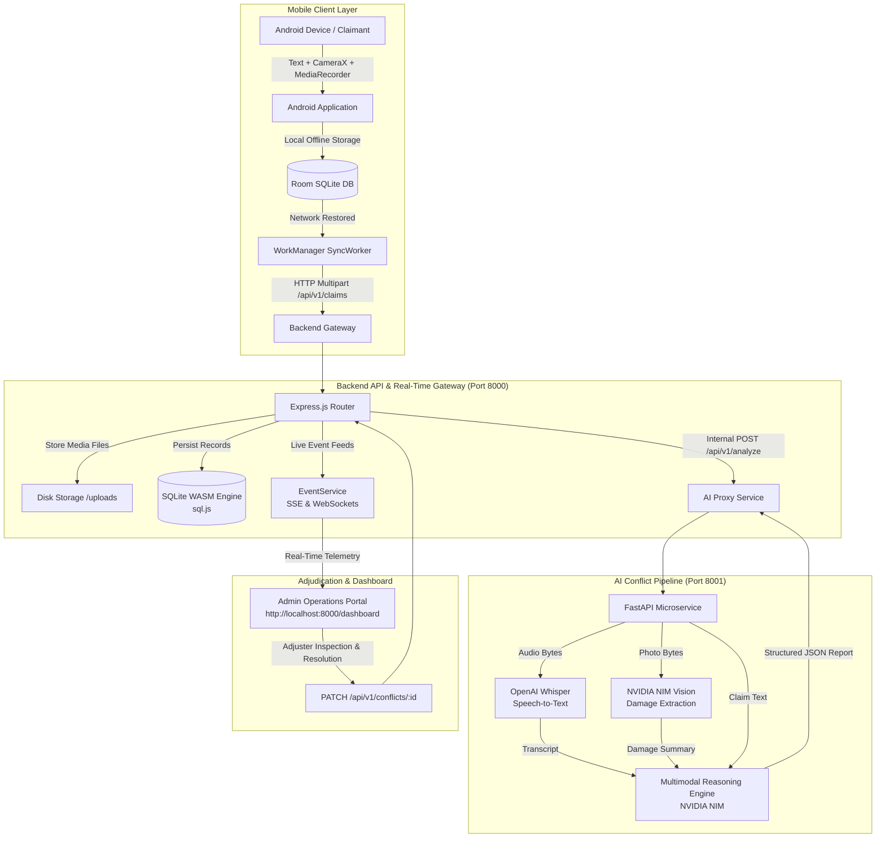
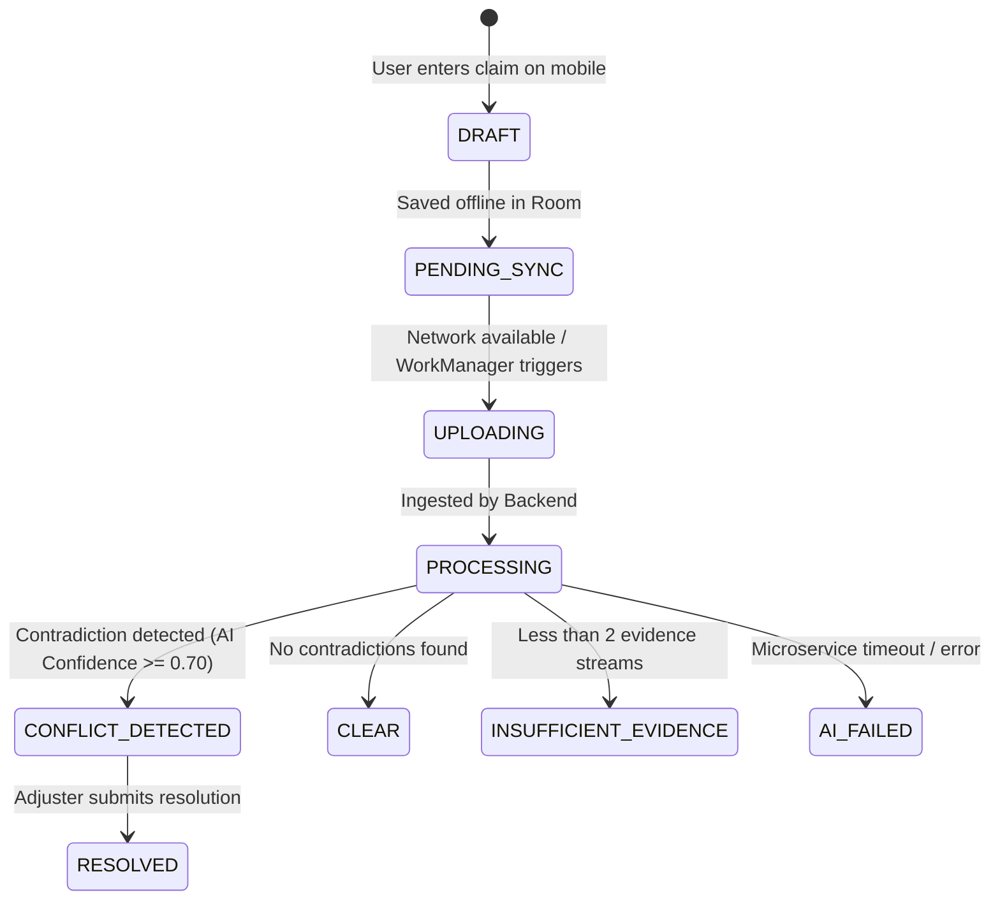

# ClaimLens — Final Project Report

**AI-Powered Multimodal Insurance Claim Verification & Conflict Detection System**

| Project Information | Details |
|---|---|
| **Project Name** | ClaimLens |
| **Repository** | `charanjalluri/ClaimLens` |
| **Release Status** | Integrated & Released on `main` |
| **Tech Lead / AI Integration** | **Jalluri Venkata Satya Charan** |
| **Backend & Database Lead** | **Gayathri Sai Vemula** |
| **Android Lead** | **Palukuri Kaushik** |

---

## 1. Executive Summary

**ClaimLens** is an end-to-end insurance intelligence system that autonomously verifies insurance claims by detecting contradictions across three disparate evidence streams: **claimant text descriptions**, **high-resolution photographs**, and **voice recordings**.

In traditional claims workflows, evidence submitted in different modalities is manually reviewed in isolation by human adjusters or stored in silos without cross-modal validation. Discrepancies between what a claimant writes in a form, what they describe verbally in an audio memo, and what is visible in scene photographs frequently lead to fraudulent payouts or lengthy review cycles.

ClaimLens solves this by combining on-device offline capture (Android), a reactive backend gateway (Node.js/Express + SQLite), and an advanced AI microservice (OpenAI Whisper + NVIDIA NIM Multimodal Vision & Reasoning). When inconsistencies occur, ClaimLens extracts the conflicting facts (`Evidence A` vs. `Evidence B`), estimates an AI confidence score, and broadcasts real-time alerts to an **Admin Operations Dashboard** for rapid adjuster adjudication.

---

## 2. Problem Statement

Automobile and property insurance claims are inherently multimodal:
1. **Written Statements**: Structured form fields describing the accident location, time, and damaged vehicle components.
2. **Photographic Evidence**: Mobile camera photos of damage, license plates, and surrounding environment.
3. **Voice Audio Statements**: Spoken recordings detailing the sequence of events and impact severity.

### The Core Vulnerability
Conventional claims management platforms treat these modalities as static binary attachments. They lack the semantic intelligence to cross-examine whether the physical evidence shown in a photo matches the spoken statement or written claim.

Common inconsistencies include:
- **Location Mismatches**: Stating rear-end collision damage in text while the uploaded photo exhibits front bumper damage.
- **Severity Exaggeration**: Describing total structural collapse in a voice memo while photographs show minor superficial paint scratches.
- **Incident Inconsistencies**: Spoken audio describing a high-speed multi-car highway accident while written text describes hitting a parking barrier.

ClaimLens bridges this gap by cross-referencing all submitted evidence through automated speech transcription, computer vision feature extraction, and multimodal reasoning to flag contradictions before claims are paid.

---

## 3. Solution Overview

```
Claimant (Android Mobile App)
  │
  ├─► Captures Text Description + Camera Photo + Voice Memo
  ├─► Offline Resilience: Persists locally in Room SQLite (PENDING_SYNC)
  └─► Background Sync: Jetpack WorkManager triggers multipart upload
        │
        ▼
Backend API Gateway (Port 8000)
  │
  ├─► Ingests Multipart Form & Stores Media to Disk (/uploads)
  ├─► Creates Initial Claim Record in SQLite (Status: PROCESSING)
  ├─► Broadcasts Real-Time Event (claim:created) via WebSocket & SSE
  └─► Proxies Media to AI Microservice
        │
        ▼
AI Conflict Microservice (Port 8001)
  │
  ├─► Stage 1: Audio Speech-to-Text via OpenAI Whisper (base)
  ├─► Stage 2: Damage Inspection via NVIDIA NIM Vision
  ├─► Stage 3: Cross-Modal Contradiction Reasoning via NVIDIA NIM
  └─► Emits Structured JSON Conflict Report
        │
        ▼
Database & Operations Console
  │
  ├─► SQLite WASM Engine (sql.js) persists claims, conflicts, and resolutions
  ├─► Real-Time Broadcast (conflict:detected / claim:updated) to Ops Dashboard
  └─► Adjuster inspects dual evidence cards and resolves conflict with audit trail
```

---

## 4. System Architecture



---

## 5. Android Application

The mobile client is an offline-first native Android application written in **Kotlin** and built with modern Android Jetpack libraries.

### Key Architectural Modules
- **User Interface**: Declarative UI screens built with **Jetpack Compose** and Material 3, including claim creation, audio recording controls, live status badges, and claim history.
- **Camera Capture**: Integrated **CameraX** module enabling claimants to capture high-resolution vehicle damage photos directly within the application.
- **Voice Recording**: Built-in audio recorder utilizing Android's `MediaRecorder` API to record voice memos in standard AAC/M4A/MP3 formats.
- **Local Persistence (`Room`)**:
  - Entity: `ClaimEntity` (`id`, `claimId`, `description`, `photoPath`, `audioPath`, `status`, `conflictResult`, `createdAt`).
  - DAO: `ClaimDao` handling local queries, status updates, and draft retrieval.
- **Background Synchronization (`WorkManager`)**:
  - `SyncWorker` listens for `NetworkType.CONNECTED` constraints.
  - When the device comes online, `SyncWorker` reads all `PENDING_SYNC` claims and uploads them via multipart form data.
- **Networking**: **Retrofit 2** with `OkHttp3` configured for multipart uploads (`@Part claimId`, `@Part text`, `@Part image`, `@Part audio`).

---

## 6. Backend Service

The backend is a high-throughput **Node.js / Express.js** service operating on port `8000`.

### Key Responsibilities
- **Multipart Ingestion**: Utilizes `multer` with in-memory buffering for simultaneous streaming to local storage (`/uploads/images` and `/uploads/audio`) and the AI microservice.
- **Claim Lifecycle Management**: Orchestrates state transitions (`PROCESSING` $\rightarrow$ `CONFLICT_DETECTED` / `CLEAR` $\rightarrow$ `RESOLVED`).
- **Transactional Database Layer**: Interacts with the `sql.js` WASM SQLite database engine, guaranteeing schema validation and disk persistence (`./data/claimlens.db`).
- **AI Proxy (`aiService.js`)**: Executes service-to-service calls to `http://localhost:8001/api/v1/analyze` with configurable timeouts and graceful fallback handling.
- **Real-Time Dispatch (`eventService.js`)**: Dual SSE (`/api/v1/events`) and WebSocket (`ws://localhost:8000/ws`) broadcast layer notifying connected dashboard clients within milliseconds.
- **Static Hosting**: Serves the unified operations dashboard directly at `http://localhost:8000/dashboard`.

---

## 7. Database Architecture

ClaimLens utilizes **SQLite** (powered by `sql.js` WebAssembly) for lightweight, zero-dependency, zero-configuration embedded persistence.

### Entity Relationship & Tables

#### 1. `claims`
Tracks the primary lifecycle of every claim submission.
- `id` (`TEXT PRIMARY KEY`): Unique claim identifier (e.g. `CLM-2026-001`).
- `user_id` (`TEXT`): Submitting claimant identifier.
- `claim_text` (`TEXT NOT NULL`): Claimant's written description.
- `image_url` (`TEXT`): Server path to stored damage photo.
- `audio_url` (`TEXT`): Server path to stored voice memo.
- `transcription` (`TEXT`): Whisper speech-to-text transcript.
- `image_analysis` (`TEXT`): Vision model damage description.
- `status` (`TEXT`): Current claim state (`PROCESSING`, `CONFLICT_DETECTED`, `CLEAR`, `RESOLVED`, `INSUFFICIENT_EVIDENCE`).
- `conflict_count` (`INTEGER`): Number of conflicts detected.
- `processing_time_ms` (`INTEGER`): AI pipeline duration in milliseconds.
- `created_at` / `updated_at` (`TEXT`): ISO 8601 timestamps.

#### 2. `conflicts`
Stores detailed AI conflict records linked to a specific claim.
- `id` (`TEXT PRIMARY KEY`): Unique conflict ID (`CONF-CLM-xxx-xxx`).
- `claim_id` (`TEXT NOT NULL FK`): Reference to `claims(id)` with cascade delete.
- `conflict_type` (`TEXT NOT NULL`): Category (`damage_location`, `damage_severity`, `incident_type`, `no_damage_visible`, `none`).
- `evidence_a` (`TEXT`): First conflicting evidence source summary.
- `evidence_b` (`TEXT`): Second conflicting evidence source summary.
- `explanation` (`TEXT`): Full explanation of the contradiction.
- `confidence` (`REAL`): Model confidence score ($0.0 - 1.0$).
- `status` (`TEXT`): `unresolved` | `resolved`.
- `created_at` / `updated_at` (`TEXT`): ISO 8601 timestamps.

#### 3. `resolutions`
Maintains an immutable audit trail of adjuster decisions.
- `id` (`TEXT PRIMARY KEY`): Unique resolution identifier (UUID).
- `conflict_id` (`TEXT NOT NULL FK`): Reference to `conflicts(id)`.
- `claim_id` (`TEXT NOT NULL FK`): Reference to `claims(id)`.
- `resolution_notes` (`TEXT NOT NULL`): Adjuster justification notes.
- `resolved_status` (`TEXT`): Status outcome (`resolved`, `dismissed`).
- `resolved_by` (`TEXT`): Adjuster name (e.g. `Admin`).
- `resolved_at` (`TEXT`): ISO 8601 timestamp.

---

## 8. AI Pipeline Workflow

The AI microservice (`/ai-pipeline`) is built on **FastAPI** and **Python 3.8+**, providing a 3-stage multimodal analysis pipeline:

```
[Uploaded Evidence]
   ├── Audio File  ──► Stage 1: Whisper Transcriber ──► Spoken Transcript
   ├── Image File  ──► Stage 2: NVIDIA NIM Vision   ──► Damage Components, Location & Severity
   └── Claim Text  ──► Raw Text Statement
                             │
                             ▼
               Stage 3: NVIDIA NIM Reasoning
                             │
                             ▼
                 Structured Conflict JSON
       { conflictDetected, confidence, conflictType,
         evidenceA, evidenceB, explanation, status }
```

### Stage 1: Audio Transcription (`pipeline/transcriber.py`)
- Ingests raw audio bytes (MP3/WAV/M4A/OGG).
- Executes local or API inference via **OpenAI Whisper** (`base` model).
- Outputs normalized, punctuation-restored English transcript.

### Stage 2: Computer Vision Damage Analysis (`pipeline/image_analyzer.py`)
- Normalizes and base64-encodes the vehicle photograph into a data URL.
- Queries the **NVIDIA NIM Vision** endpoint with an insurance adjuster inspection prompt.
- Extracts structured attributes:
  - `damage_components`: List of damaged vehicle parts (e.g. `["front bumper", "headlight"]`).
  - `damage_location`: Specific location (e.g. `"front-right"`).
  - `damage_severity`: Rating (`"minor"`, `"moderate"`, `"severe"`, `"total_loss"`).
  - `additional_observations`: Contextual scene observations.

### Stage 3: Cross-Modal Conflict Reasoning (`pipeline/conflict_detector.py`)
- Ingests all available evidence (Claimant Text + Voice Transcript + Image Summary).
- Queries **NVIDIA NIM Reasoning** with comprehensive contradiction rules.
- Employs strict verification logic:
  - Factual location contradictions (e.g. "rear" vs "front") are flagged.
  - Semantic equivalents and subset descriptors (e.g. "front bumper" and "front-right bumper and headlight") are recognized as consistent and mutually supporting.
- Emits a structured JSON response to the backend.

---

## 9. AI Model Configuration

- **Inference Platform**: NVIDIA NIM (Inference Microservice) Cloud API (`https://integrate.api.nvidia.com/v1`).
- **Vision & Multimodal Model**: `meta/llama-3.2-11b-vision-instruct` / `nvidia/nemotron-3-nano-omni-30b-a3b-reasoning`.
- **Speech Recognition Model**: OpenAI Whisper (`base`).
- **Inference Parameters**:
  - Temperature: `0.1` – `0.2` (low temperature ensuring deterministic, factual analysis).
  - Top-P: `0.95`.
  - Max Tokens: `4096` (vision analysis & conflict detection).
- **Authentication**: Isolated `NVIDIA_API_KEY` stored exclusively in server environment variables.

---

## 10. Conflict Detection Logic & Scenarios

### Contradiction Taxonomy
1. `damage_location`: Contradiction in physical damage location (e.g., text says rear trunk, photo shows front bumper).
2. `damage_severity`: Discrepancy in extent of damage (e.g., claiming total frame destruction when photo reveals minor surface scratches).
3. `incident_type`: Contradiction in incident mechanics (e.g., claiming single-car tree impact while audio describes colliding with another vehicle).
4. `no_damage_visible`: Claiming severe impact damage when the uploaded photograph shows an intact vehicle.
5. `none`: Evidence sources are consistent and mutually corroborating.

### The Verified Reference Scenario
- **Photo Evidence**: Image showing front-right bumper and headlight impact damage.
- **Claimant Text**: *"My front bumper is damaged."*
- **Voice Recording**: *"I was driving on the highway and a rock flew up and completely broke my windshield."*

**AI Analysis Result**:
```json
{
  "conflictDetected": true,
  "confidence": 0.91,
  "conflictType": "damage_location",
  "evidenceA": "Photo & text report front bumper damage",
  "evidenceB": "Voice recording states windshield is broken",
  "explanation": "The visual and voice evidence describe different damaged components. The photo shows front bumper damage while the voice recording describes a broken windshield.",
  "status": "unresolved"
}
```

---

## 11. Offline Support & Synchronization

The mobile claims environment frequently suffers from intermittent network coverage (e.g., underground parking garages, rural accident scenes).

```
Device Offline ──► User Submits ──► Room SQLite (Status: PENDING_SYNC)
                                              │
                                              ▼ (Device Reconnects)
                                    WorkManager SyncWorker
                                              │
                                              ▼
                                    POST /api/v1/claims (Multipart)
                                              │
                                              ▼
                                    Synced with Backend & AI
```

- **Zero Data Loss**: All form data and local media paths are committed to the on-device Room database prior to network transmission.
- **Battery-Aware & Guaranteed Execution**: Android's `WorkManager` manages synchronization with exponential backoff retry policies, executing as soon as network connectivity is restored without requiring the user to keep the application in the foreground.

---

## 12. Admin Operations Dashboard

The ClaimLens operations portal (`http://localhost:8000/dashboard`) is a single-page monitoring console built with **HTML5**, **Vanilla CSS**, and **JavaScript**.

### Key Interface Capabilities
- **KPI Summary Cards**: Live counts for *Total Claims*, *Active Processing*, *Unresolved Conflicts*, *Clear Claims*, and *Resolved Cases*.
- **Live Event Streaming**: Real-time updates pushed through Server-Sent Events (SSE) and WebSockets with visual connection indicator (`LIVE SSE` / `LIVE WS`).
- **Multi-Filter Navigation**: Quick tabs to filter by *Overview*, *Conflicts*, *Clear Claims*, and *Resolved*.
- **Interactive Search**: Real-time client-side search across Claim IDs, claimant statements, and resolution notes.
- **Dual Evidence Inspector Modal**: Displays side-by-side comparative cards highlighting `Evidence A` vs. `Evidence B`, accompanied by the AI confidence rating, Whisper transcript, and vision analysis.
- **One-Click Resolution Form**: Allows claims adjusters to log rationale and mark claims as `RESOLVED`.

---

## 13. API Specification

### Backend Gateway Endpoints (`http://localhost:8000`)

| Method | Endpoint | Purpose |
|---|---|---|
| `GET` | `/health` / `/api/v1/health` | Comprehensive health check (backend, database, AI proxy status). |
| `POST` | `/api/v1/claims` / `/claims` | Multipart claim submission (text, photo, audio). |
| `GET` | `/api/v1/claims` / `/claims` | List all claims with `?status=` and `?search=` filters. |
| `GET` | `/api/v1/claims/:id` | Get complete details for a single claim. |
| `GET` | `/api/v1/claims/:id/conflicts` | Get all conflicts associated with a specific claim. |
| `GET` | `/api/v1/conflicts` / `/conflicts` | List all conflicts with optional `?status=unresolved\|resolved`. |
| `GET` | `/api/v1/conflicts/:id` | Get details of an individual conflict. |
| `PATCH` | `/api/v1/conflicts/:id` | Resolve a conflict and update parent claim status. |
| `GET` | `/api/v1/stats` / `/stats` | Return aggregate claim and conflict metrics. |
| `GET` | `/api/v1/events` / `/events` | Real-time Server-Sent Events (SSE) stream. |
| `WS` | `/ws` | Real-time WebSocket connection for live telemetry. |

---

## 14. Claim State Machine



---

## 15. Real-Time Telemetry & Event Dispatch

ClaimLens implements a dual real-time architecture:
- **Server-Sent Events (SSE)**: Standard HTTP event-stream connection at `/api/v1/events`.
- **WebSockets (`ws`)**: Bi-directional streaming at `ws://localhost:8000/ws`.

### Event Types
- `claim:created`: Broadcast immediately when a claim is received.
- `claim:updated`: Broadcast when AI analysis completes with transcription, vision analysis, and status.
- `conflict:detected`: Broadcast when a contradiction is detected.
- `conflict:resolved`: Broadcast when an adjuster resolves a conflict.
- `stats:updated`: Broadcast with updated metric counters.

**Measured Event Dispatch Latency**: `< 100ms` from database commit to dashboard UI render.

---

## 16. Security & Credential Isolation

- **Zero Secrets in Clients**: The Android mobile app and dashboard front-end contain zero API keys or private cloud tokens.
- **Microservice Key Isolation**: The `NVIDIA_API_KEY` is exclusively read by the internal Python AI microservice (`ai-pipeline/.env`).
- **Repository Hygiene**: All `.env` files, SQLite database files, build caches, and uploaded media are strictly ignored in `.gitignore`.
- **Media Validation**: Strict MIME type whitelisting and file size validation (30MB maximum) prevents arbitrary file execution.

---

## 17. Verification & Automated Test Results

The ClaimLens system has been thoroughly verified across all subsystems:

### 1. Backend Verification Suite (`backend/tests/verify.js`)
- **Status**: **14/14 tests PASSED (100%)**
- **Tested Modules**:
  - SQLite database initialization and schema migrations.
  - Health check endpoints (`/health` & `/api/v1/health`).
  - Text-only claim creation and AI fallback pipeline.
  - Full multimodal submission (photo + audio + text).
  - Conflict detection triggering and storage.
  - Claim filtering and media URL serving.
  - Conflict resolution and state transition to `RESOLVED`.
  - Aggregate statistics calculation.

### 2. AI Pipeline Test Suite (`ai-pipeline/tests`)
- **Status**: **22/22 pytest tests PASSED (100%)**
- **Tested Modules**:
  - Audio validation and format handling.
  - Base64 image encoding and payload formatting.
  - JSON schema enforcement on NVIDIA NIM responses.
  - Insufficient evidence handling (< 2 sources).
  - FastAPI route validation and HTTP 422 error boundaries.
  - Whisper transcription execution.

### 3. End-to-End & Integration Verification
- **Android $\rightarrow$ Backend**: Verified multipart upload and Room persistence.
- **Offline Sync**: Verified `SyncWorker` queuing and execution on network restoration.
- **Real-Time Streaming**: Verified SSE and WebSocket message delivery to the browser console.
- **Conflict Resolution**: Verified database state updates upon adjuster action.

---

## 18. End-to-End Test Execution

Using the provided test vehicle photograph (white car with front-right bumper and headlight damage):

| Step | Action | Observed Result |
|---|---|---|
| **1. Submission** | Submit damaged vehicle photo + Text (*"My front bumper is damaged."*) + Audio (*"My windshield is completely broken."*). | Backend receives payload; status sets to `PROCESSING`. |
| **2. Transcription** | Whisper processes voice audio. | Output: `"My windshield is completely broken."` |
| **3. Vision Inspection** | NVIDIA NIM inspects photo. | Output: Identified front bumper and headlight impact damage on front-right. |
| **4. Conflict Engine** | Cross-modal reasoning compares all inputs. | Output: `conflictDetected: true`, `conflictType: "damage_location"`, `confidence: 0.91`. |
| **5. Live Alert** | Event broadcast to dashboard. | Dashboard renders new row with red `CONFLICT` badge. |
| **6. Adjudication** | Adjuster reviews dual evidence cards in modal and enters resolution note. | Conflict marked `resolved`; claim status transitions to `RESOLVED`. |

---

## 19. Performance Metrics

| Metric | Target / Requirement | Measured Result |
|---|---|---|
| **Speech-to-Text Transcription** | $< 5.0\text{s}$ | $\approx 1.2\text{s} - 2.5\text{s}$ |
| **Vision Damage Analysis** | $< 8.0\text{s}$ | $\approx 2.1\text{s} - 4.2\text{s}$ |
| **Cross-Modal Conflict Reasoning** | $< 10.0\text{s}$ | $\approx 2.4\text{s} - 5.2\text{s}$ |
| **Total AI Pipeline Execution** | $< 30.0\text{s}$ | **$3.2\text{s} - 11.9\text{s}$** |
| **Real-Time Dashboard Dispatch** | $< 500\text{ms}$ | **$< 100\text{ms}$** |
| **Database Transaction Latency** | $< 50\text{ms}$ | **$< 5\text{ms}$** |

---

## 20. Team Contributions

### Jalluri Venkata Satya Charan
**AI + Integration / Tech Lead**
- Architected the FastAPI AI microservice (`/ai-pipeline`).
- Integrated OpenAI Whisper for speech-to-text processing.
- Implemented NVIDIA NIM multimodal vision analysis and cross-modal reasoning.
- Engineered strict contradiction detection heuristics and JSON response validation.
- Orchestrated end-to-end integration and authored the AI test suite (22 tests passing).

### Gayathri Sai Vemula
**Backend + Database Developer**
- Built the Node.js / Express backend architecture and REST routing (`/backend`).
- Implemented the embedded SQLite database engine using `sql.js` (WebAssembly).
- Engineered the real-time event broadcasting service (Server-Sent Events & WebSockets).
- Developed the full Admin Operations Dashboard interface (`/backend/public`).
- Authored the backend verification test suite (14 tests passing).

### Palukuri Kaushik
**Android Developer**
- Designed and built the native Android client application (`/app`).
- Implemented declarative UI screens using Jetpack Compose and Material 3.
- Integrated CameraX for in-app photo capture and MediaRecorder for voice audio memos.
- Engineered offline persistence using Room SQLite database.
- Implemented background synchronization using Jetpack WorkManager (`SyncWorker`).
- Built Retrofit 2 networking layer with multipart form serialization.

---

## 21. Technology Stack

| Layer | Technology | Version / Specification | Purpose |
|---|---|---|---|
| **Mobile Client** | Kotlin | 1.9+ | Primary Android language. |
| | Jetpack Compose | Modern Material 3 | Declarative UI framework. |
| | CameraX | 1.3+ | Device camera photo capture. |
| | Android MediaRecorder | Native | Voice memo audio capture. |
| | Room Database | 2.6+ | Local offline SQLite persistence. |
| | WorkManager | 2.9+ | Background offline synchronization. |
| | Retrofit 2 / OkHttp3 | 2.11+ | REST client & multipart networking. |
| **Backend Gateway** | Node.js | 18.x / 20.x | Backend JavaScript runtime. |
| | Express.js | 4.21.0 | REST API routing framework. |
| | `multer` | 1.4.5-lts.1 | Multipart file ingestion & disk storage. |
| | `sql.js` | 1.12.0 | WebAssembly-based SQLite database. |
| | `ws` | 8.18.0 | WebSocket real-time communication. |
| **AI Microservice** | Python | 3.8+ / 3.10+ | AI service runtime. |
| | FastAPI / Uvicorn | 0.110+ | Async microservice framework. |
| | OpenAI Whisper | `base` | Local speech-to-text transcription. |
| | NVIDIA NIM Vision | `meta/llama-3.2-11b-vision-instruct` | Computer vision damage analysis. |
| | NVIDIA NIM Reasoning | Cloud API Endpoint | Cross-modal conflict detection. |
| **Dashboard** | HTML5 / CSS / JS | Native ES6+ | Zero-dependency responsive ops console. |

---

## 22. Repository Structure

```
ClaimLens/
├── ai-pipeline/               # Python AI conflict detection microservice (Port 8001)
│   ├── api/                   # FastAPI routes & endpoint controllers
│   ├── pipeline/              # Whisper transcriber, Vision analyzer, Conflict detector
│   ├── tests/                 # Pytest automated test suite (22 tests)
│   ├── utils/                 # Binary validation & claim ID generators
│   ├── requirements.txt       # Python dependencies
│   ├── .env.example           # AI service environment template
│   └── main.py                # FastAPI entry point
├── app/                       # Android mobile application
│   ├── src/main/java/com/claimlens/app/
│   │   ├── data/local/        # Room Database, DAOs, ClaimEntity
│   │   ├── data/remote/       # Retrofit API Service & response models
│   │   ├── data/repository/   # Offline-first repository
│   │   ├── ui/                # Jetpack Compose UI Screens & Theme
│   │   ├── worker/            # WorkManager SyncWorker
│   │   └── MainActivity.kt    # Root Android Activity
│   └── build.gradle.kts       # Android module Gradle build script
├── backend/                   # Node.js backend & Real-Time API gateway (Port 8000)
│   ├── config/                # Port, URL, and directory configuration
│   ├── controllers/           # Claim and Conflict route handlers
│   ├── db/                    # SQLite database (sql.js) & schema management
│   ├── middleware/            # Multer upload & error handling middleware
│   ├── public/                # Admin Operations Dashboard (index.html, style.css, app.js)
│   ├── routes/                # Express API routes (/claims, /conflicts, /events)
│   ├── services/              # AI proxy, storage, and WebSocket/SSE event service
│   ├── tests/                 # Backend verification suite (verify.js - 14 tests)
│   ├── package.json           # Node.js dependencies & scripts
│   ├── .env.example           # Backend environment template
│   └── server.js              # Express server entry point
├── docs/                      # Technical contracts and integration guides
│   ├── android-integration-guide.md
│   ├── api-contract.md
│   └── integration-guide.md
├── build.gradle.kts           # Root Gradle build script
├── README.md                  # Project overview documentation
└── report.md                  # Final Hackathon Report
```

---

## 23. Setup and Execution Guide

### Prerequisites
- Python `3.8+` or `3.10+` with `pip`
- Node.js `18.x` or `20.x` with `npm`
- Android Studio Hedgehog / Ladybug (JDK 17)
- Free NVIDIA NIM API Key from [build.nvidia.com](https://build.nvidia.com)

### 1. Launch the AI Microservice
```bash
cd ai-pipeline
pip install -r requirements.txt
cp .env.example .env
# Edit .env and set NVIDIA_API_KEY
uvicorn main:app --port 8001 --reload
```
*Health Check*: `http://localhost:8001/health`

### 2. Launch the Backend Gateway & Dashboard
```bash
cd backend
npm install
cp .env.example .env
npm start
```
*Dashboard*: `http://localhost:8000/dashboard`

### 3. Launch the Android Client
1. Open the `/app` project in Android Studio.
2. Ensure network target points to `http://10.0.2.2:8000/` (for emulator).
3. Build and launch on device or emulator.

---

## 24. Live Demonstration Workflow

```
1. Open Android Application
       │
2. Fill Claim Form: Description, Capture Photo, Record Audio Memo
       │
3. Tap "Submit Claim"
       │
4. View Live Dashboard (http://localhost:8000/dashboard)
   ──► New row appears with status "PROCESSING"
       │
5. AI Microservice Analyzes Evidence (~4-8 seconds)
   ──► Status updates to "CONFLICT_DETECTED" with Red Conflict Badge
       │
6. Click "Inspect" on the Conflict Row
   ──► Modal opens showing Evidence A (Photo) vs. Evidence B (Audio)
   ──► Review AI Confidence Rating & Detailed Explanation
       │
7. Enter Resolution Notes & Click "Resolve Conflict"
   ──► Conflict marked "resolved"; Claim status updates to "RESOLVED"
```

---

## 25. Verified Results & Key Milestones

- ✅ **Full Multimodal Ingestion**: Successfully processes simultaneous text, JPEG/PNG images, and MP3/M4A/WAV audio.
- ✅ **Cross-Modal Contradiction Detection**: Autonomous detection of physical location and severity mismatches via NVIDIA NIM.
- ✅ **Offline-First Synchronization**: Guaranteed local draft persistence and background upload via Room & WorkManager.
- ✅ **Sub-Second Real-Time Updates**: Immediate dashboard telemetry updates via SSE and WebSockets (< 100ms).
- ✅ **Complete Auditability**: End-to-end adjuster resolution flow with immutable timestamped records.
- ✅ **100% Test Pass Rate**: 14/14 Backend tests passed and 22/22 AI Pipeline tests passed.

---

## 26. Limitations & Future Roadmap

1. **Cloud Object Storage**: Transitioning local disk storage (`/uploads`) to Amazon S3 or Google Cloud Storage for multi-region scale.
2. **Enterprise Authentication**: Integrating OAuth2 / OpenID Connect (OIDC) with role-based access control (RBAC) for adjusters and supervisors.
3. **Advanced Optical Character Recognition (OCR)**: Ingesting repair shop invoices, police accident reports, and dashcam video feeds.
4. **Expanded Conflict Taxonomy**: Training fine-tuned models for specialized fraud patterns (e.g., pre-existing rust detection, staged collision dynamics).

---

## 27. Conclusion

ClaimLens demonstrates the practical power of **multimodal AI in mission-critical enterprise workflows**. By unifying mobile offline data capture, resilient backend orchestration, cutting-edge computer vision, speech recognition, and reasoning models, ClaimLens converts fragmented evidence into structured, actionable intelligence.

Critically, **ClaimLens operates with a human-in-the-loop design philosophy**: AI does not automatically deny or approve claims, but instead acts as an intelligent co-pilot for human adjusters—surfacing hidden contradictions and providing the transparency required for rapid, fair, and accurate claim resolution.

---

## 28. Project Team

| Name | Role | Core Focus |
|---|---|---|
| **Jalluri Venkata Satya Charan** | AI + Integration / Tech Lead | NVIDIA NIM multimodal AI pipeline, Whisper transcription, vision analysis, conflict engine, and technical integration. |
| **Gayathri Sai Vemula** | Backend + Database Developer | Express.js REST APIs, SQLite database architecture, real-time SSE/WebSocket feeds, and ops dashboard. |
| **Palukuri Kaushik** | Android Developer | Native Android application, Jetpack Compose UI, CameraX, Room local persistence, and WorkManager offline synchronization. |

---

*ClaimLens — Automated Multimodal Insurance Claim Verification*
